# IoT Weather Station - Circuit Wiring & Pinout Guide
**Project:** AeroMetrics Pro / Karmakar Industry IoT Weather Station  
**Microcontroller:** ESP32 NodeMCU (30-pin or 38-pin Development Board)

---

## 1. Complete Pin Connection Mapping Table

| Sensor / Module | Module Pin | ESP32 Pin | GPIO | Description / Notes |
| :--- | :--- | :--- | :--- | :--- |
| **SSD1306 OLED (128x64)** | VCC | 3V3 / 3.3V | — | Power (3.3V recommended) |
| | GND | GND | — | Common Ground |
| | SCL / SCK | D22 | GPIO 22 | I2C Clock Line (shared bus) |
| | SDA | D21 | GPIO 21 | I2C Data Line (shared bus) |
| **BMP280 Barometric Sensor** | VCC / VIN | 3V3 | — | Power (3.3V) |
| | GND | GND | — | Common Ground |
| | SCL | D22 | GPIO 22 | I2C Clock Line (shared with OLED) |
| | SDA | D21 | GPIO 21 | I2C Data Line (shared with OLED) |
| | CSB / SDO | — | — | Leave floating or SDO to GND for addr 0x76 |
| **DHT11 Temp & Humidity** | VCC (+) | 3V3 / 5V | — | Power (3.3V or 5V) |
| | GND (-) | GND | — | Common Ground |
| | DATA / OUT | D14 | GPIO 14 | Digital Data (with 10k pullup if 3-pin bare sensor) |
| **Touch Sensor (TTP223)** | VCC | 3V3 | — | Power (3.3V) |
| | GND | GND | — | Common Ground |
| | SIG / OUT | D4 | GPIO 4 | Digital Input / Capacitive Touch T0 |

---

## 2. Mermaid Circuit Topology

```mermaid
flowchart TD
    subgraph Power["Power Rail"]
        V33["ESP32 3.3V Pin"]
        GND["ESP32 GND Pin"]
    end

    subgraph ESP32["ESP32 Microcontroller"]
        G21["GPIO 21 (I2C SDA)"]
        G22["GPIO 22 (I2C SCL)"]
        G14["GPIO 14 (DHT Data)"]
        G4["GPIO 4 (Touch Signal)"]
    end

    subgraph OLED["0.96 inch SSD1306 OLED Display"]
        O_VCC["VCC"]
        O_GND["GND"]
        O_SDA["SDA"]
        O_SCL["SCL"]
    end

    subgraph BMP["BMP280 Barometric Pressure"]
        B_VCC["VCC"]
        B_GND["GND"]
        B_SDA["SDA"]
        B_SCL["SCL"]
    end

    subgraph DHT["DHT11 Sensor"]
        D_VCC["VCC"]
        D_GND["GND"]
        D_OUT["DATA"]
    end

    subgraph TOUCH["TTP223 Touch Module"]
        T_VCC["VCC"]
        T_GND["GND"]
        T_SIG["OUT"]
    end

    V33 --> O_VCC
    V33 --> B_VCC
    V33 --> D_VCC
    V33 --> T_VCC

    GND --> O_GND
    GND --> B_GND
    GND --> D_GND
    GND --> T_GND

    G21 --> O_SDA
    G21 --> B_SDA

    G22 --> O_SCL
    G22 --> B_SCL

    G14 --> D_OUT
    G4 --> T_SIG
```

---

## 3. Hardware Operational Notes

1. **Shared I2C Bus**:
   - Both the **SSD1306 OLED** (`0x3C`) and the **BMP280** (`0x76` or `0x77`) share **GPIO 21 (SDA)** and **GPIO 22 (SCL)** without any pin conflicts due to unique I2C bus addressing.
2. **Touch Sensor Options**:
   - **TTP223 Digital Touch Module**: Connect `SIG` to **GPIO 4**. Set `USE_CAPACITIVE_TOUCH false` in `config.h`.
   - **Capacitive Touch Wire**: You can connect a single copper wire directly to **GPIO 4 (Touch Pin T0)** and set `USE_CAPACITIVE_TOUCH true` in `config.h`.
3. **Power Stability**:
   - For stable Wi-Fi transmissions and sensor readings, power the ESP32 via a standard 5V USB-C or micro-USB cable delivering at least 1A current.
